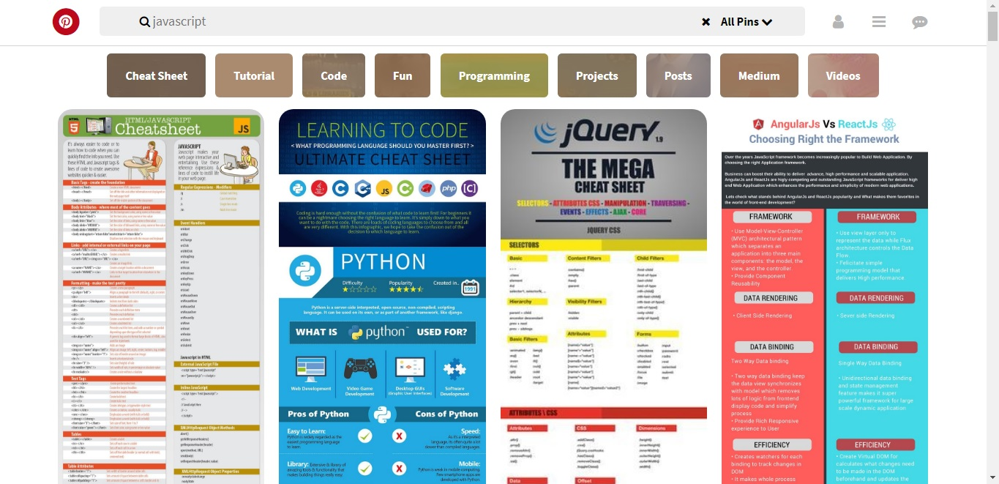

# Pinterest

#### Replicar el maquetado del sitio de [Pinterest](https://laboratoria.github.io/pinterestify/).

1. Crear el HTML de la web.
2. Crear el header para el menú principal.
3. Agregar secciones individuales para el logo, input y los íconos.
4. Crear un navegador para el menú de filtro.
5. Darle estilo al header y al menú de filtro.
6. Crear la sección principal.
7. Crear contenedor para las fotos.
8. Agregar fotos.
9. Darle estilo a la sección de fotos. 
